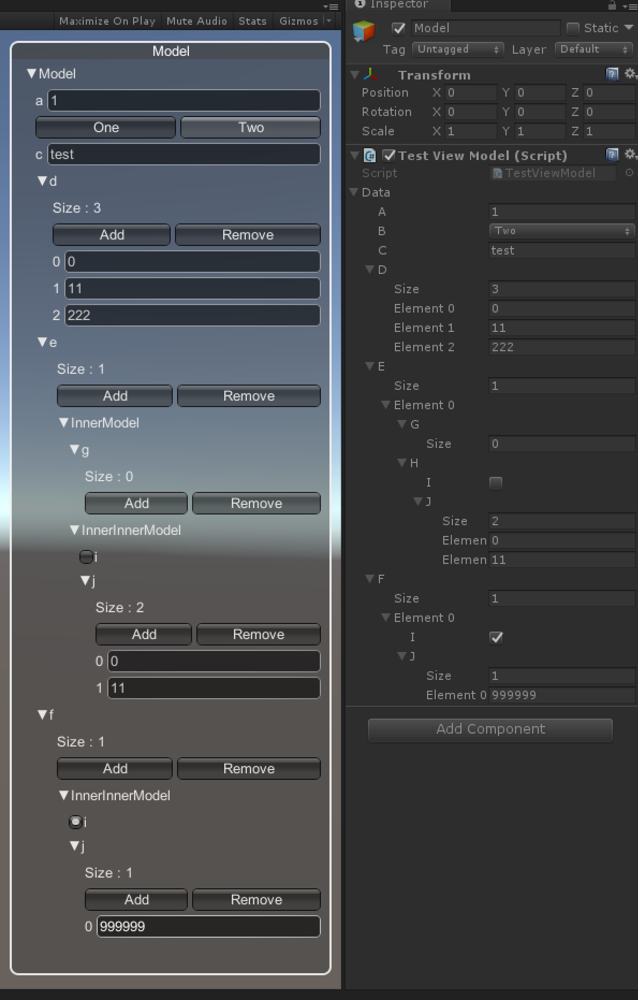

# Model Driven GUI Generation for Unity


Features:
 - MVVM architecture
 - Factory-based GUI (View)

Supported types:
 - Primitives (int, float, etc.)
 - Vector2, Vector3, etc.
 - User defined classes
 - Arrays

## Usage
Define data class (Model)
```csharp
[System.Serializable]
public class InnerModel {
    public bool bool01;
    public string string01;
    public int int01;
    public float float01;
}
[System.Serializable]
public class Model {
    public enum SimpleEnum { One, Two }

    public Vector2 vec2_01;
    public Vector3 vec3_01;
    public Vector4 vec4_01;
    public Vector2Int vec2int01;

    public InnerModel innerClass01;
}
```
Create view from the data
```csharp
public class TestViewModel : MonoBehaviour {
    public Model data;
    protected BaseView view;
    
    void OnEnable() {
        var model = new FieldValue<object>(this, this.GetField(c => c.data));
        var viewFactory = new SimpleViewFactory();
        view = ClassConfigurator.GenerateClassView(new BaseValue<object>(data), viewFactory);
    }
    void OnDisable() {
        view.Dispose();
    }
```
Call Draw() method in MonoBehaviour.OnGUI()
```csharp
    void OnGUI() {
         view.Draw();
    }
```

[Sample](ModelDrivenGUI/blob/master/Examples/TestViewModel.cs)

## Installation
Import [UniRx](https://www.assetstore.unity3d.com/#!/content/17276) plugin from Unity Asset Store.

Add this repository in your project.
```
git submodule add https://github.com/nobnak/ModelDrivenGUI.git Assets/Packages/ModelDrivenGUI
```
